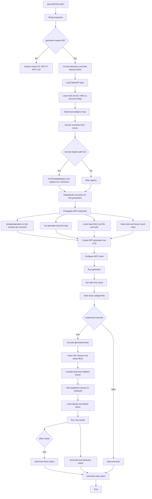
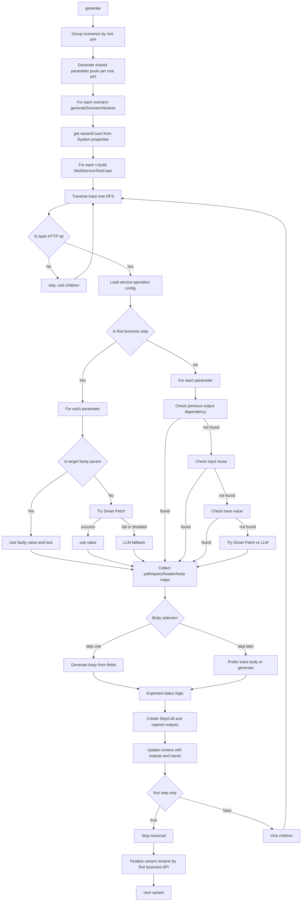
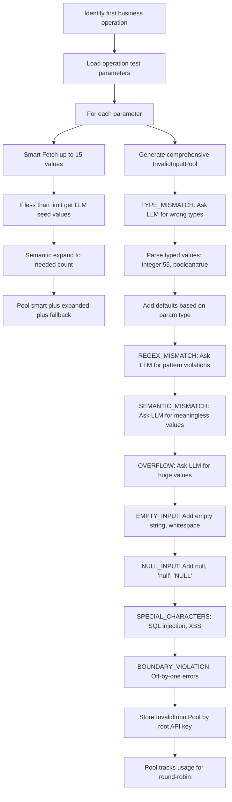
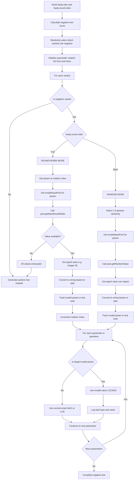
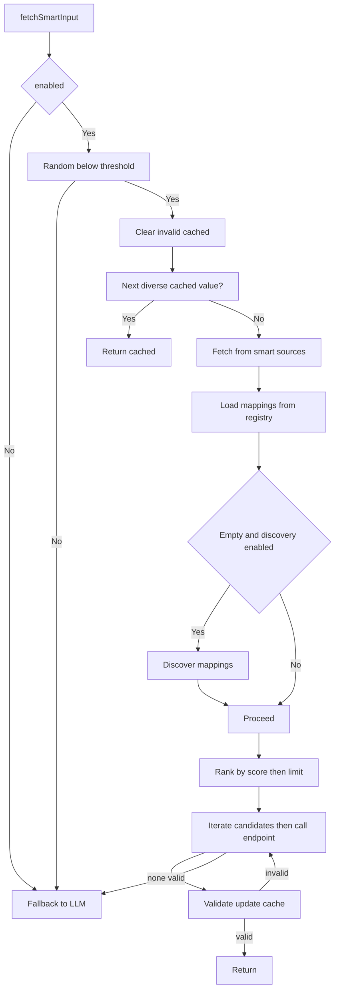
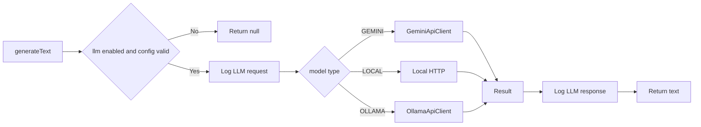
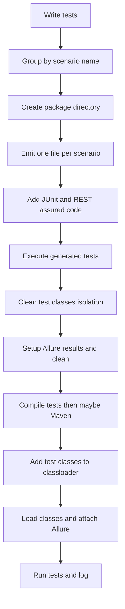

### MST Mode End-to-End Flow (TestGenerationAndExecution.java)



**Critical Design Decision: Registry Before Deduplication**

The MST flow registers **ALL scenarios** to the Root API Registry BEFORE deduplication:

1. **Extract scenarios from traces** → Get all workflow patterns from Jaeger
2. **Register ALL scenarios** → Root API Registry learns from every trace (even duplicates)
   - Why? Because different traces with the same root API may have different execution patterns, timings, or data flows
   - The registry benefits from seeing all variations to build a comprehensive understanding
3. **Then deduplicate scenarios** → Remove scenarios with the same ROOT API for test generation
   - Why? To avoid generating redundant test cases that would waste resources
   - **Deduplication is based on ROOT API ONLY** (HTTP method + path of first business API call)
   - Different downstream workflows (success vs failure traces) are treated as duplicates if they share the same root API

**Example:**
- 2 traces both start with `POST /api/v1/adminorder` (same root API)
  - Trace 1: Admin order success → downstream calls (station, route, database)
  - Trace 2: Admin order failure → error handling calls
- Both are registered in the Root API Registry (learning from both success and failure patterns)
- But only 1 scenario generates test cases (avoiding redundant tests for the same root API)
- Result: 15 test cases instead of 30 (2 × 15)

### MST Test Case and Input Generation (MultiServiceTestCaseGenerator)



### Shared Parameter Pool Generation (per root API)



### Negative Test Selection with 8 Fault Types (Configurable Strategy)



**Strategies**:
- **Round-Robin** (faulty.round-robin=true, default): 
  - ONE invalid param per test, cycling through all params
  - For each param, cycles through all 8 fault types and their values
  - NO REPETITION until all invalid values exhausted
  - **All 8 Fault Types (with examples)**:
    1. **TYPE_MISMATCH**: Wrong data type
       - Example: String param gets `Integer(55)` or `Boolean(true)`
       - Example: Number param gets `"not_a_number"` or `Boolean(false)`
    2. **REGEX_MISMATCH**: Pattern violation
       - Example: Email param gets `"invalid@format"` (missing domain)
       - Example: Phone param gets `"123"` (wrong format)
       - Example: Date param gets `"not-a-date"` (invalid format)
    3. **SEMANTIC_MISMATCH**: Meaningless/impossible value
       - Example: Age param gets `-5` (negative age)
       - Example: Birthdate param gets `"2050-01-01"` (future date)
       - Example: Status param gets `"INVALID_STATUS"` (not in enum)
    4. **OVERFLOW**: Exceeds limits
       - Example: String param gets `"AAAA..."` (1000+ characters)
       - Example: Number param gets `9999999999` (beyond max)
       - Example: Path param gets `tripId_1234567890_1234567890_...` (very long)
    5. **EMPTY_INPUT**: Empty values ( !ONLY for REQUIRED params)
       - Example: Required string gets `""` (empty string)
       - Example: Required string gets `"   "` (whitespace only)
       - Example: Required array gets `[]` (empty array)
    6. **NULL_INPUT**: Null values ( !ONLY for REQUIRED params)
       - Example: Required param gets `null` (actual null)
       - Example: Required param gets `"null"` (string "null")
       - Example: Required param gets `"NULL"` (string "NULL")
    7. **SPECIAL_CHARACTERS**: Injection attempts
       - Example: SQL injection: `"' OR '1'='1"`
       - Example: XSS attack: `"<script>alert('XSS')</script>"`
       - Example: Path traversal: `"../../../etc/passwd"`
       - Example: Command injection: `"; rm -rf /"`
    8. **BOUNDARY_VIOLATION**: Off-by-one errors
       - Example: Min=1 param gets `0` (min-1)
       - Example: Max=100 param gets `101` (max+1)
       - Example: MinLength=5 param gets `"abcd"` (length 4)
       - Example: MaxLength=10 param gets `"12345678901"` (length 11)
  - **Example Round-Robin Sequence**:
    - Test 1: paramA=TYPE_MISMATCH(Integer(55))
    - Test 2: paramB=REGEX_MISMATCH("invalid@format")
    - Test 3: paramA=SEMANTIC_MISMATCH(-5)
    - Test 4: paramC=OVERFLOW("AAAA..." (1000 chars))
    - Test 5: paramA=EMPTY_INPUT("")  (if paramA is required)
    - Test 6: paramB=NULL_INPUT(null)  (if paramB is required)
    - Test 7: paramA=SPECIAL_CHARACTERS("' OR '1'='1")
    - Test 8: paramC=BOUNDARY_VIOLATION(0)  (if min=1)
    - Test 9: paramA=TYPE_MISMATCH(Boolean(true))  (next value for paramA)
    - ... continues until all invalid values exhausted
  - When exhausted: generates positive tests
  
- **Random** (faulty.round-robin=false):
  - 1-3 randomly selected invalid params per test
  - Random fault type and value selection
  - CAN REPEAT values across tests
  - Test 1: [paramA=TYPE_MISMATCH(55), paramC=NULL_INPUT(null)]
  - Test 2: [paramB=SPECIAL_CHARACTERS("' OR '1'='1")]
  - Test 3: [paramA=TYPE_MISMATCH(55), paramB=EMPTY_INPUT(""), paramC=OVERFLOW("AAAA...")]

### Negative Test Reporting (Allure Integration)

```mermaid
flowchart LR
    A[Test case marked as negative] --> B[Track invalid parameters during generation]
    B --> C[Writer checks if test is negative]
    C --> D[Add Allure parameter Test Type NEGATIVE]
    D --> E[Add Allure parameter Invalid Parameters list]
    E --> F[Add Allure description with invalid values and fault types]
    F --> G[Report displays in Allure with warning icon]
    G --> H[Test expects 4XX/5XX error response]
    H --> I[If 2XX received test FAILS]
```



### 8 Invalid Input Types (Comprehensive Coverage)

```mermaid
flowchart TD
    A[Invalid Input Types] --> B1[TYPE_MISMATCH]
    A --> B2[REGEX_MISMATCH]
    A --> B3[SEMANTIC_MISMATCH]
    A --> B4[OVERFLOW]
    A --> B5[EMPTY_INPUT *]
    A --> B6[NULL_INPUT *]
    A --> B7[SPECIAL_CHARACTERS]
    A --> B8[BOUNDARY_VIOLATION]
    
    B1 --> C1[Wrong data type<br/>String param gets Integer 55]
    B2 --> C2[Pattern violation<br/>Email without @ symbol]
    B3 --> C3[Meaningless value<br/>Age = -5, impossible date]
    B4 --> C4[Exceeds limits<br/>10000 char string, MAX_INT]
    B5 --> C5[Empty values<br/>Empty string, whitespace, []<br/>ONLY for REQUIRED params]
    B6 --> C6[Null values<br/>null, 'null', 'NULL'<br/>ONLY for REQUIRED params]
    B7 --> C7[Injection attempts<br/>SQL injection, XSS, traversal]
    B8 --> C8[Boundary errors<br/>Off-by-one, min-1, max+1]
    
    Note1[* Empty/Null inputs are VALID for optional parameters<br/>They are only generated for required parameters]
```

**Important: Optional Parameter Handling**
- **EMPTY_INPUT** and **NULL_INPUT** are only generated for **required parameters** (`required: true`)
- For **optional parameters** (`required: false` or not specified), null/empty values are **valid** and should NOT be used for negative testing
- This ensures negative tests only target true violations, not legitimate optional parameter behavior

### Smart Input Fetching Flow (SmartInputFetcher)



### LLM Communication Path (LLMService)



### Writer and Execution Flow (MultiServiceRESTAssuredWriter + IntelliJ runner)



### Conditions, Flags, and Inputs (key branches)

- generator == MST: switches to multi-service flow
- testsperoperation / test.variants.per.scenario: number of variants per scenario
- mst.generate.only.first.step: generate only first business step (writer handles login as step 0)
- faulty.ratio: percentage of test variants that should be intentionally faulty (e.g., 0.1 = 10%)
- faulty.round-robin: true (default) = one param per test cycling, false = 1-3 random params per test
- smart.input.fetch.enabled: enables Smart Fetch system
- smart.input.fetch.percentage: probability Smart Fetch vs LLM
- smart.input.fetch.registry.path: registry used for mappings and learning
- smart.input.fetch.llm.discovery.enabled: allows LLM-based mapping discovery
- smart.input.fetch.max.candidates: max endpoints tried per parameter
- smart.input.fetch.dependency.resolution.enabled: resolve parameter dependencies
- smart.input.fetch.discovery.timeout.ms: discovery request timeout
- smart.input.fetch.cache.enabled / ttl: cache values and TTL
- llm.enabled: enables LLM; llm.model.type: gemini/local/ollama
- llm.gemini.*, llm.local.*, llm.ollama.*: backend-specific
- llm.rate.limit.retry.enabled / max.retries: retry policy
- root.api.registry.path: enables Root API registry population from scenarios
- allure.report: generate Allure report after execution
- experiment.execute: execute tests vs only generate
- deletepreviousresults: clean allure/data outputs before run
- fault.detection.injected.faults.path / fault.detection.report.dir: fault injection & reporting

### Notes on Data/Status Selection

- First business step: parameters prefer Smart Fetch -> LLM fallback; body from generated fields
- Subsequent steps: prefer dependencies (prev outputs -> inputs) -> trace -> Smart Fetch -> LLM -> fallback
- Expected status: config -> successful status from trace (if config 200) -> default 200


