### MST Mode End-to-End Flow (TestGenerationAndExecution.java)

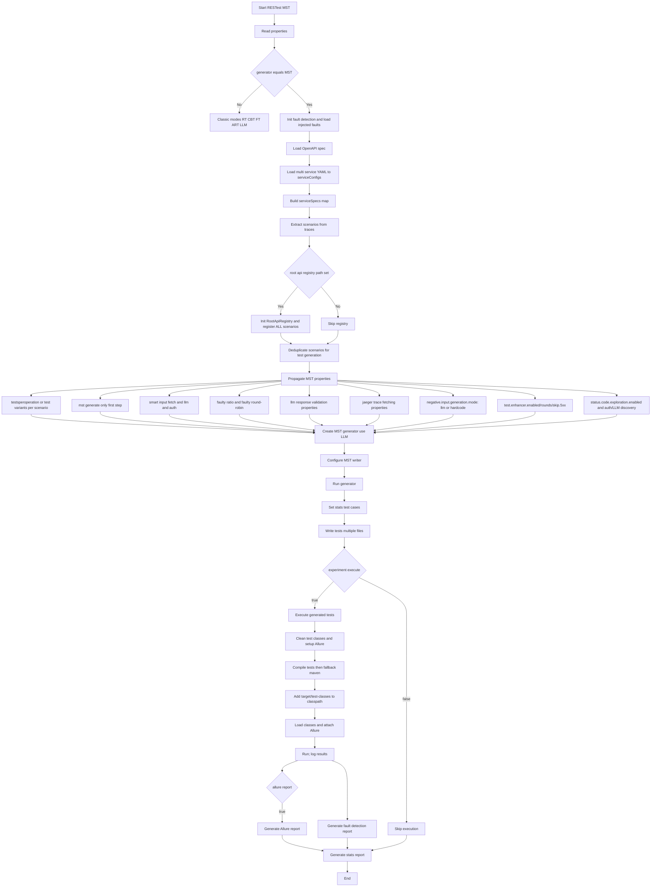

**Critical Design Decision: Registry Before Deduplication**

The MST flow registers **ALL scenarios** to the Root API Registry BEFORE deduplication:

1. **Extract scenarios from traces** → Get all workflow patterns from Jaeger
2. **Register ALL scenarios** → Root API Registry learns from every trace (even duplicates)
   - Why? Because different traces with the same root API may have different execution patterns, timings, or data flows
   - The registry benefits from seeing all variations to build a comprehensive understanding
3. **Then deduplicate scenarios** → Remove scenarios with the same ROOT API for test generation
   - Why? To avoid generating redundant test cases that would waste resources
   - **Deduplication is based on ROOT API ONLY** (HTTP method + path of first business API call)
   - Different downstream workflows (success vs failure traces) are treated as duplicates if they share the same root API

**Example:**
- 2 traces both start with `POST /api/v1/adminorder` (same root API)
  - Trace 1: Admin order success → downstream calls (station, route, database)
  - Trace 2: Admin order failure → error handling calls
- Both are registered in the Root API Registry (learning from both success and failure patterns)
- But only 1 scenario generates test cases (avoiding redundant tests for the same root API)
- Result: 15 test cases instead of 30 (2 × 15)

### MST Test Case and Input Generation (MultiServiceTestCaseGenerator)

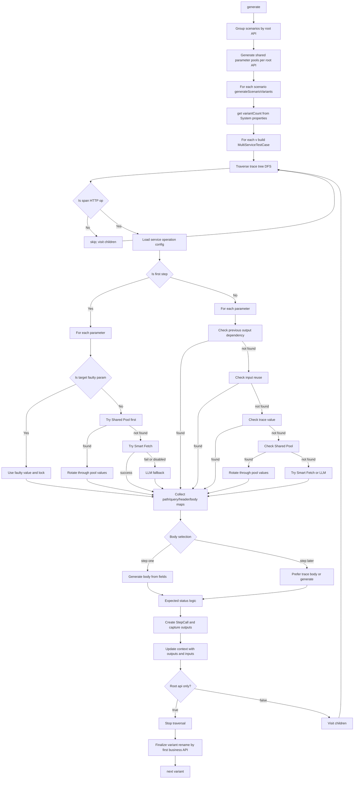

### Shared Parameter Pool Generation (per root API)

**Purpose**: Pre-generate parameter values once per root API to avoid redundant Smart Fetch/LLM calls and ensure consistent value rotation across test variants.

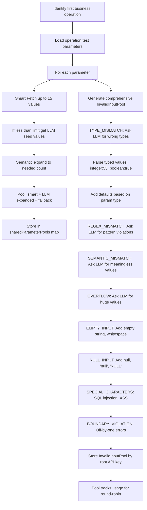

### Shared Parameter Pool Usage (during variant generation)

**Strategy**: Use pre-generated shared pool values with rotation to maximize efficiency and diversity.

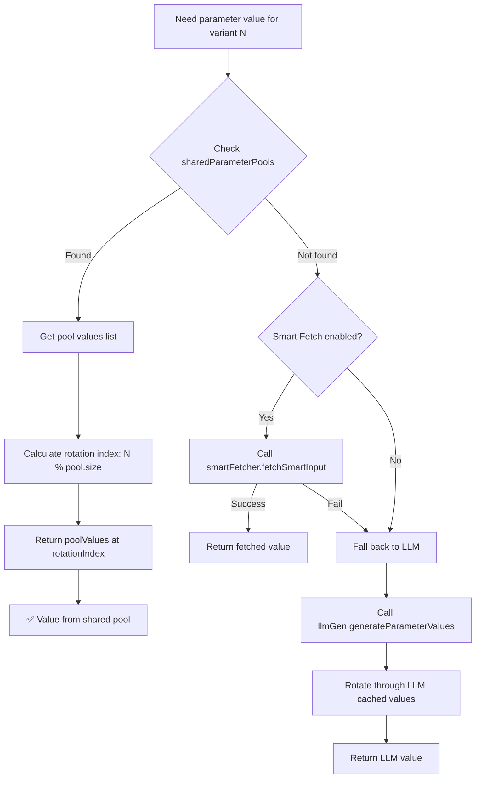

**Key Benefits**:
1. **Performance**: Pre-generated pools eliminate redundant Smart Fetch/LLM calls during variant generation
2. **Consistency**: All variants use values from the same pre-generated pool
3. **Diversity**: Rotation through 15 pool values ensures each variant gets different values
4. **Fallback**: Direct Smart Fetch/LLM calls only when pool doesn't exist for a parameter

**Example Execution**:
- Root API: `POST /api/v1/adminroute`
- Parameter: `startStation`
- Shared Pool: `["Beijing", "Shanghai", "Guangzhou", "Shenzhen", "Chengdu", ...]` (15 values)
- Variant 1: `startStation = "Beijing"` (index 0)
- Variant 2: `startStation = "Shanghai"` (index 1)
- Variant 3: `startStation = "Guangzhou"` (index 2)
- ...
- Variant 16: `startStation = "Beijing"` (index 0, rotates back)

### Negative Test Selection with 8 Fault Types (Configurable Strategy)

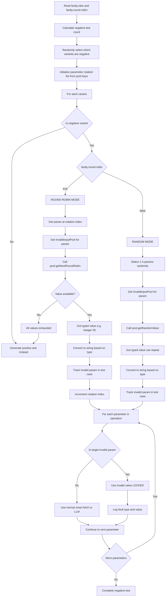

**Strategies**:
- **Round-Robin** (faulty.round-robin=true, default): 
  - ONE invalid param per test, cycling through all params
  - For each param, cycles through all 8 fault types and their values
  - NO REPETITION until all invalid values exhausted
  - **All 8 Fault Types (with examples)**:
    1. **TYPE_MISMATCH**: Wrong data type
       - Example: String param gets `Integer(55)` or `Boolean(true)`
       - Example: Number param gets `"not_a_number"` or `Boolean(false)`
    2. **REGEX_MISMATCH**: Pattern violation
       - Example: Email param gets `"invalid@format"` (missing domain)
       - Example: Phone param gets `"123"` (wrong format)
       - Example: Date param gets `"not-a-date"` (invalid format)
    3. **SEMANTIC_MISMATCH**: Meaningless/impossible value
       - Example: Age param gets `-5` (negative age)
       - Example: Birthdate param gets `"2050-01-01"` (future date)
       - Example: Status param gets `"INVALID_STATUS"` (not in enum)
    4. **OVERFLOW**: Exceeds limits
       - Example: String param gets `"AAAA..."` (1000+ characters)
       - Example: Number param gets `9999999999` (beyond max)
       - Example: Path param gets `tripId_1234567890_1234567890_...` (very long)
    5. **EMPTY_INPUT**: Empty values ( !ONLY for REQUIRED params)
       - Example: Required string gets `""` (empty string)
       - Example: Required string gets `"   "` (whitespace only)
       - Example: Required array gets `[]` (empty array)
    6. **NULL_INPUT**: Null values ( !ONLY for REQUIRED params)
       - Example: Required param gets `null` (actual null)
       - Example: Required param gets `"null"` (string "null")
       - Example: Required param gets `"NULL"` (string "NULL")
    7. **SPECIAL_CHARACTERS**: Injection attempts
       - Example: SQL injection: `"' OR '1'='1"`
       - Example: XSS attack: `"<script>alert('XSS')</script>"`
       - Example: Path traversal: `"../../../etc/passwd"`
       - Example: Command injection: `"; rm -rf /"`
    8. **BOUNDARY_VIOLATION**: Off-by-one errors
       - Example: Min=1 param gets `0` (min-1)
       - Example: Max=100 param gets `101` (max+1)
       - Example: MinLength=5 param gets `"abcd"` (length 4)
       - Example: MaxLength=10 param gets `"12345678901"` (length 11)
  - **Example Round-Robin Sequence**:
    - Test 1: paramA=TYPE_MISMATCH(Integer(55))
    - Test 2: paramB=REGEX_MISMATCH("invalid@format")
    - Test 3: paramA=SEMANTIC_MISMATCH(-5)
    - Test 4: paramC=OVERFLOW("AAAA..." (1000 chars))
    - Test 5: paramA=EMPTY_INPUT("")  (if paramA is required)
    - Test 6: paramB=NULL_INPUT(null)  (if paramB is required)
    - Test 7: paramA=SPECIAL_CHARACTERS("' OR '1'='1")
    - Test 8: paramC=BOUNDARY_VIOLATION(0)  (if min=1)
    - Test 9: paramA=TYPE_MISMATCH(Boolean(true))  (next value for paramA)
    - ... continues until all invalid values exhausted
  - When exhausted: generates positive tests
  
- **Random** (faulty.round-robin=false):
  - 1-3 randomly selected invalid params per test
  - Random fault type and value selection
  - CAN REPEAT values across tests
  - Test 1: [paramA=TYPE_MISMATCH(55), paramC=NULL_INPUT(null)]
  - Test 2: [paramB=SPECIAL_CHARACTERS("' OR '1'='1")]
  - Test 3: [paramA=TYPE_MISMATCH(55), paramB=EMPTY_INPUT(""), paramC=OVERFLOW("AAAA...")]

### Negative Test Reporting (Allure Integration)

```mermaid
flowchart LR
    A[Test case marked as negative] --> B[Track invalid parameters during generation]
    B --> C[Writer checks if test is negative]
    C --> D[Add Allure parameter Test Type NEGATIVE]
    D --> E[Add Allure parameter Invalid Parameters list]
    E --> F[Add Allure description with invalid values and fault types]
    F --> G[Report displays in Allure with warning icon]
    G --> H[Test expects 4XX/5XX error response]
    H --> I[If 2XX received test FAILS]
```

### 8 Invalid Input Types (Comprehensive Coverage)

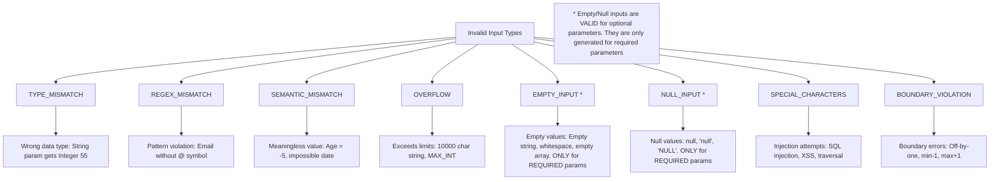

**Important: Optional Parameter Handling**
- **EMPTY_INPUT** and **NULL_INPUT** are only generated for **required parameters** (`required: true`)
- For **optional parameters** (`required: false` or not specified), null/empty values are **valid** and should NOT be used for negative testing
- This ensures negative tests only target true violations, not legitimate optional parameter behavior

### Smart Input Fetching Flow (SmartInputFetcher)

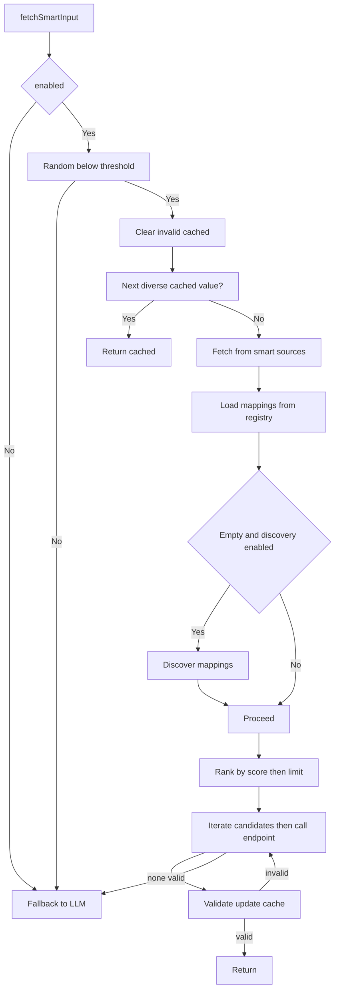

### LLM Communication Path (LLMService)

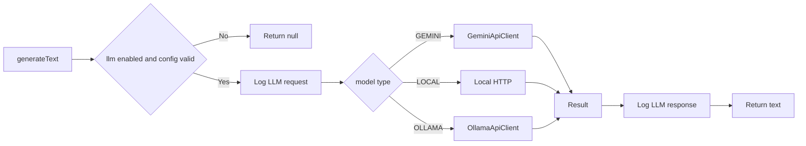

### LLM Response Validation System (ZeroShotLLMGenerator.validateResponse)

**Purpose**: Detect "soft errors" - APIs that return 200 OK but include error information in the response body.

**Validation Prompt Structure:**

```
System Prompt (Instructions):
- Analysis criteria for failure detection
- 4 categories of failure indicators
- Output format requirements
- Emphasis on precision (avoid false positives)

User Prompt (Task):
- API details (service, endpoint, status code)
- Response body JSON
- Examples of soft errors vs valid success
- Request for analysis
```

**LLM Analysis Criteria:**

1. **Explicit Failure Indicators**:
   - `status: 0` or `status: false` or `status: "error"`
   - `success: false`
   - `error: true` or `hasError: true`

2. **Error Messages**:
   - Fields named: `error`, `errorMessage`, `msg`, `message`, `errorMsg`
   - Exception information or stack traces

3. **Data Validation**:
   - `data` field is `null` or empty when data is expected
   - Empty result arrays when results are expected

4. **Business Logic Errors**:
   - Validation error messages ("invalid parameters", "not found")
   - Constraint violation messages

**LLM Output Format:**
```
FAILED: true|false
RCA: <detailed root cause analysis>
```

**Integration with Test Validation:**

```
Positive Test + LLM says FAILED  → Test FAILS (expected success, got soft error)
Positive Test + LLM says SUCCESS → Test PASSES (as expected)
Negative Test + LLM says FAILED  → Test PASSES (expected error, got soft error)
Negative Test + LLM says SUCCESS → Test FAILS (expected error, got success)
```

**Performance Optimization:**
- Only validates 2XX responses by default (`llm.response.validation.only.2xx=true`)
- Uses focused prompts with higher token limit (500) and lower temperature (0.3)
- Gracefully handles LLM failures (logs warning, doesn't break test execution)

### Writer and Execution Flow (MultiServiceRESTAssuredWriter + IntelliJ runner)

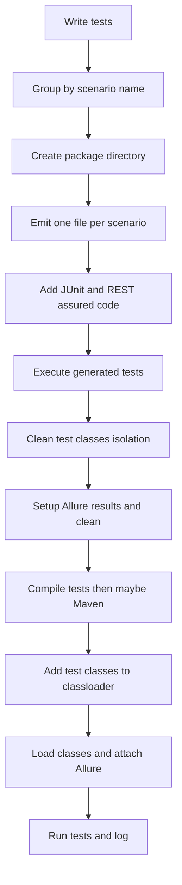

### Test Execution and Validation Flow (Configuration-Based Status Code Validation)

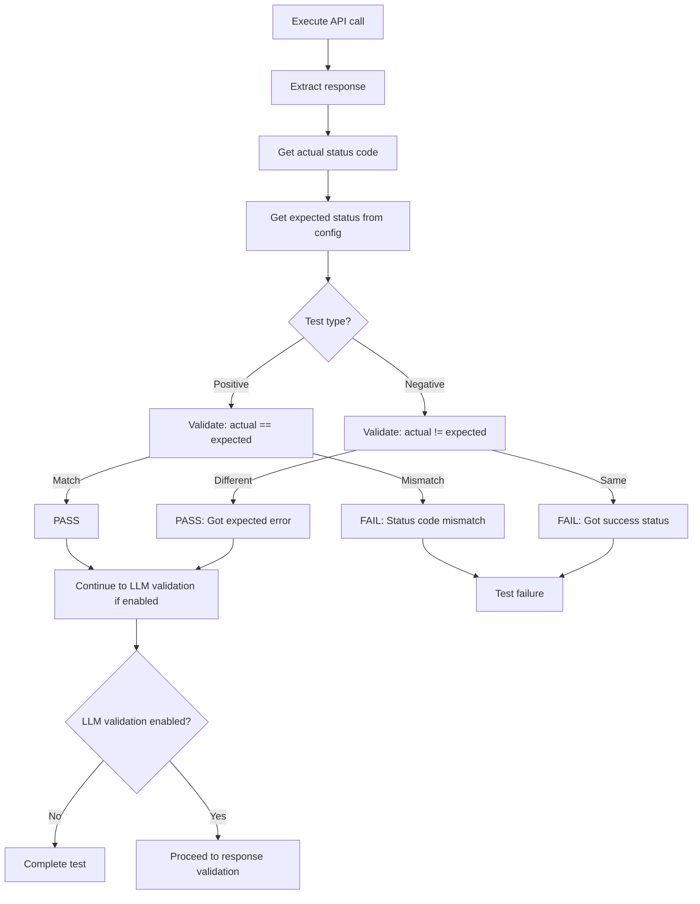

**Key Changes from Previous Implementation:**
- **Before**: Hardcoded thresholds (< 400 for success)
- **After**: Uses `expectedStatus` from `real-system-conf.yaml` 
- **Positive Tests**: PASS only if `actualStatus == expectedStatus`
- **Negative Tests**: PASS if `actualStatus != expectedStatus` (any deviation is valid)

### LLM Response Validation Flow (Soft Error Detection)

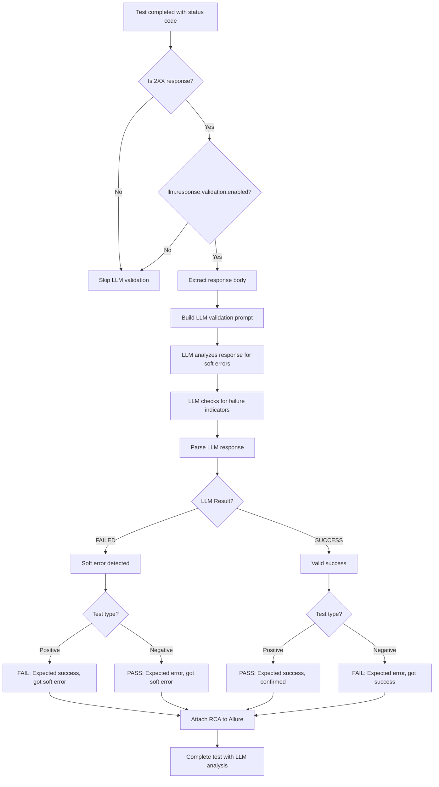

**Soft Error Indicators Detected by LLM:**
1. **Explicit failure flags**: `status: 0`, `success: false`, `error: true`
2. **Error messages**: Non-empty `error`, `errorMessage`, `msg` fields
3. **Null/empty data**: `data: null` when data is expected
4. **Business logic errors**: Validation messages, constraint violations

**Example Soft Error:**
```json
{
  "status": 0,
  "msg": "start or end station not include in stationList.",
  "data": null
}
```
- HTTP Status: 200 OK
- LLM Detection: ❌ SOFT ERROR (status=0, error message present, data is null)
- Positive Test: FAIL (expected success, got soft error)
- Negative Test: PASS (expected error, got soft error)

### Conditions, Flags, and Inputs (key branches)

**Core MST Configuration:**
- generator == MST: switches to multi-service flow
- testsperoperation / test.variants.per.scenario: number of variants per scenario
- mst.generate.only.first.step: generate only first business step (writer handles login as step 0)
- faulty.ratio: percentage of test variants that should be intentionally faulty (e.g., 0.1 = 10%)
- faulty.round-robin: true (default) = one param per test cycling, false = 1-3 random params per test

**Smart Input Fetching:**
- smart.input.fetch.enabled: enables Smart Fetch system
- smart.input.fetch.percentage: probability Smart Fetch vs LLM
- smart.input.fetch.registry.path: registry used for mappings and learning
- smart.input.fetch.llm.discovery.enabled: allows LLM-based mapping discovery
- smart.input.fetch.max.candidates: max endpoints tried per parameter
- smart.input.fetch.dependency.resolution.enabled: resolve parameter dependencies
- smart.input.fetch.discovery.timeout.ms: discovery request timeout
- smart.input.fetch.cache.enabled / ttl: cache values and TTL

**LLM Configuration:**
- llm.enabled: enables LLM; llm.model.type: gemini/local/ollama
- llm.gemini.*, llm.local.*, llm.ollama.*: backend-specific
- llm.rate.limit.retry.enabled / max.retries: retry policy

**LLM Response Validation (Soft Error Detection):**
- llm.response.validation.enabled: enables LLM-powered validation of 2XX responses (default: true)
- llm.response.validation.only.2xx: only validate 2XX responses for performance (default: true)
- llm.response.validation.include.rca: include detailed RCA in Allure reports (default: true)

**Jaeger Trace Fetching:**
- jaeger.enabled: enables Jaeger trace fetching for error analysis
- jaeger.base.url: Jaeger API endpoint for fetching traces
- jaeger.lookback: lookback period for trace queries (e.g., "10m", "1h")

**Root API Registry & Fault Detection:**
- root.api.registry.path: enables Root API registry population from scenarios
- fault.detection.enabled: enables fault detection tracking
- fault.detection.injected.faults.path: path to injected faults JSON registry
- fault.detection.report.dir: directory where fault detection reports are saved

**Negative Input Generation:**
- negative.input.generation.mode: `llm` or `hardcode` (default: hardcode)
  - `llm`: LLM generates context-aware invalid inputs (slower, varied)
  - `hardcode`: Deterministic hardcoded invalid inputs (faster, predictable)
- Note: For array parameters, BOTH modes generate:
  - Invalid array structures (null, empty, wrong type)
  - Arrays with invalid elements (null elements, wrong-type elements)

**Status Code Exploration (Smart Coverage):**
- status.code.exploration.enabled: enable LLM-driven status code discovery and exploration tests (default: false)
- status.code.exploration.max.per.test: max exploration tests to create per original test per round (default: 3)
- status.code.exploration.max.per.round: max exploration tests total per round (default: 20)
- status.code.auth.invalid.token: invalid token string for 401 Unauthorized exploration
- status.code.auth.expired.token: expired JWT token for auth testing
- status.code.auth.guest.user/password: guest credentials for 403 Forbidden testing
- status.code.auth.restricted.user/password: restricted user credentials for 403 testing

**Execution & Reporting:**
- allure.report: generate Allure report after execution
- experiment.execute: execute tests vs only generate
- deletepreviousresults: clean allure/data outputs before run

### Allure Report Attachments (Enhanced Intelligent Analysis)

**Attachment Structure:**

```
📎 Test Attachments:
├── 🤖 INTELLIGENT ANALYSIS (Based on Trace)    [if Jaeger trace available]
│   ├── For technical errors: LLM-generated RCA from trace error analysis
│   └── For business logic failures: Detailed recommendations and analysis
├── 🤖 INTELLIGENT ANALYSIS (Based on Response) [if LLM validation enabled and 2XX response]
│   ├── Analysis Result: ❌ SOFT ERROR DETECTED or ✅ VALID SUCCESS
│   └── Root Cause Analysis: Detailed explanation from LLM
├── 🔗 API Call Trace                          [Jaeger distributed trace visualization]
│   ├── Hierarchical service call tree
│   ├── Pass/Fail indicators for each span
│   └── Duration and status information
├── 📊 Trace Summary                           [Statistical trace summary]
│   ├── Total API calls, success/failure counts
│   ├── Services involved
│   └── Error statistics if present
├── 📥 Response (status_code)                  [Raw HTTP response]
│   └── Response body in JSON format
└── 📈 Raw Trace Data                          [Complete Jaeger trace JSON]
    └── Full trace data for debugging
```

**Intelligent Analysis Types:**

1. **Based on Trace** (Jaeger):
   - Analyzes distributed traces from Jaeger
   - Identifies technical errors (exceptions, timeouts, 5XX errors)
   - Provides service-level failure analysis
   - Includes parameter error tracking

2. **Based on Response** (LLM):
   - Analyzes 2XX response bodies for soft errors
   - Detects `status: 0`, `success: false`, error messages
   - Validates data presence and consistency
   - Provides business logic failure analysis

**Key Features:**
- Clean, consistent naming without status suffixes
- Comprehensive RCA without raw LLM output clutter
- Both trace-based and response-based analysis available
- Automatic attachment based on test outcome and configuration

### Complete Test Validation Matrix (Status Code + LLM Validation)

**Layer 1: Status Code Validation (Configuration-Based)**

| Test Type | Expected (Config) | Actual | Status Code Result |
|-----------|-------------------|--------|-------------------|
| Positive  | 200               | 200    | ✅ PASS (proceed to LLM validation if enabled) |
| Positive  | 200               | 400    | ❌ FAIL (status mismatch) |
| Positive  | 200               | 500    | ❌ FAIL (status mismatch) |
| Negative  | 200               | 200    | ⚠️ PROCEED (might be soft error, check LLM) |
| Negative  | 200               | 400    | ✅ PASS (got expected error) |
| Negative  | 200               | 500    | ✅ PASS (got expected error) |

**Layer 2: LLM Response Validation (For 2XX Responses Only)**

| Test Type | Status | LLM Analysis | Final Result | Reason |
|-----------|--------|--------------|--------------|--------|
| Positive  | 200    | SUCCESS ✅   | ✅ PASS      | Expected success, confirmed by LLM |
| Positive  | 200    | FAILED ❌    | ❌ FAIL      | Expected success, but soft error detected |
| Negative  | 200    | SUCCESS ✅   | ❌ FAIL      | Expected error, but got valid success |
| Negative  | 200    | FAILED ❌    | ✅ PASS      | Expected error, soft error detected |

**Example Scenarios:**

1. **Positive Test with Soft Error**:
   ```
   Expected: 200, Actual: 200 → Status Code: PASS
   Response: {"status":0,"msg":"error","data":null}
   LLM Analysis: FAILED (soft error)
   Final Result: ❌ FAIL (with RCA in Allure report)
   ```

2. **Negative Test with Soft Error (Correct)**:
   ```
   Expected: 200, Actual: 200 → Status Code: PROCEED
   Response: {"status":0,"msg":"error","data":null}
   LLM Analysis: FAILED (soft error)
   Final Result: ✅ PASS (negative test correctly triggered error)
   ```

3. **Negative Test with Valid Success (Incorrect)**:
   ```
   Expected: 200, Actual: 200 → Status Code: PROCEED
   Response: {"status":1,"msg":"Success","data":{...}}
   LLM Analysis: SUCCESS (valid data)
   Final Result: ❌ FAIL (negative test didn't trigger error)
   ```

### Notes on Data/Status Selection

- First business step: parameters prefer Smart Fetch -> LLM fallback; body from generated fields
- Subsequent steps: prefer dependencies (prev outputs -> inputs) -> trace -> Smart Fetch -> LLM -> fallback
- Expected status: Uses `expectedStatus` from configuration file (not hardcoded thresholds)
  - Positive tests: PASS if actual == expected
  - Negative tests: PASS if actual != expected (any deviation is valid)
- LLM response validation: Additional layer for 2XX responses to detect soft errors
  - Only runs when `llm.response.validation.enabled=true`
  - Provides detailed RCA in Allure reports
  - Gracefully handles LLM failures (doesn't break test execution)

---

## Test Case Enhancer

### Overview

The Test Case Enhancer is a post-execution feature that analyzes failed test cases and uses LLM to suggest improved parameter values based on API error responses.

### Flow Diagram

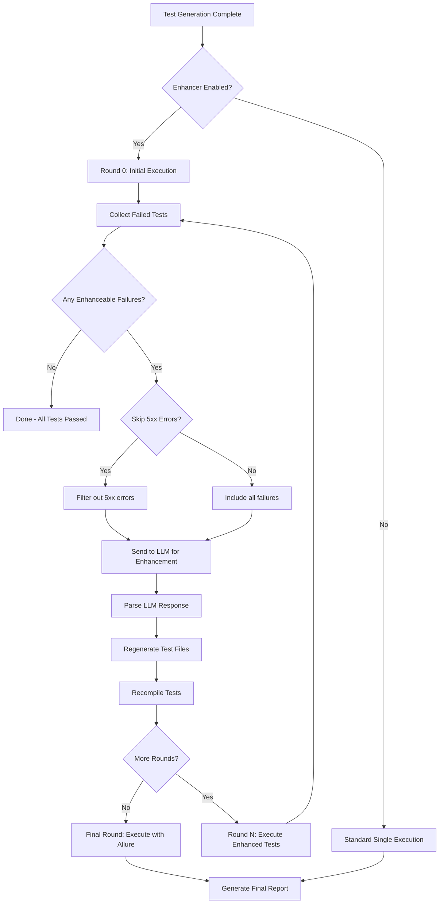

### Configuration Properties

```properties
# Test Case Enhancer Settings
test.enhancer.enabled=true         # Enable/disable the enhancer
test.enhancer.rounds=1             # Number of enhancement rounds (1-5 recommended)
test.enhancer.skip.5xx=true        # Skip 5xx errors (server bugs, not input issues)
```

### Enhancement Process

1. **Test Execution (Round 0)**
   - Execute all generated tests
   - Collect failures via `FailedTestCollector`
   - Store test context: parameters, response, status code

2. **Failure Analysis**
   - Filter out non-enhanceable failures (5xx if configured)
   - Prepare context for LLM (JSON format with all parameter details)

3. **LLM Enhancement**
   - Send failed test context to LLM
   - LLM analyzes error response and suggests improved parameter values
   - Parse structured response with new values and reasoning

4. **Test Regeneration**
   - Locate original test file
   - Replace parameter values with LLM suggestions
   - Add Allure enhancement markers

5. **Re-Execution**
   - Recompile modified tests
   - Execute enhanced tests
   - Repeat for configured number of rounds

6. **Final Reporting**
   - Final round saves results to Allure
   - Enhanced tests marked with "ENHANCED" label
   - Original failure info attached

### LLM Prompt Format

```json
{
  "testName": "test_POST_1_5",
  "endpoint": "/api/v1/travelservice/trips",
  "method": "POST",
  "isNegativeTest": false,
  "actualStatus": 400,
  "responseMessage": "{\"status\":0,\"msg\":\"Invalid station name\"}",
  "parameters": [
    {"name": "startPlace", "value": "InvalidCity", "type": "string", "location": "body", "description": "..."},
    {"name": "endPlace", "value": "Beijing", "type": "string", "location": "body", "description": "..."}
  ]
}
```

### LLM Response Format

```json
{
  "enhancedParameters": [
    {"name": "startPlace", "value": "Shanghai"},
    {"name": "endPlace", "value": "Beijing"}
  ],
  "reasoning": "Changed startPlace to a valid Chinese city name based on error message"
}
```

### Classes Involved

| Class | Responsibility |
|-------|---------------|
| `TestCaseEnhancer` | Main enhancement logic, LLM interaction |
| `FailedTestCollector` | JUnit RunListener, collects failures |
| `FailedTestResult` | Data model for failed test context |
| `ParameterSnapshot` | Data model for parameter state |
| `TestFileRegenerator` | Modifies test files with new values |
| `TestResultCapture` | ThreadLocal for runtime response capture |

### Allure Report Integration

Enhanced tests appear in Allure with:
- Label: `enhancement = ENHANCED`
- Attachment: "Original Failure" with status, response, and enhanced parameters

### Output Files

Enhancement data saved to:
```
target/enhancer/{testId}/
  round-0/
    failed-tests.json
    enhancement-results.json
  round-1/
    failed-tests.json
    enhancement-results.json
  ...
```

---

## Smart Status Code Exploration

### Overview

Smart Status Code Exploration improves coverage by discovering all possible HTTP status codes per API (via LLM and OpenAPI), tracking which codes were actually triggered during execution, and generating dedicated **exploration tests** to trigger previously untriggered codes (e.g. 401, 403, 404, 409).

**Main components:**
- **LLMStatusCodeDiscovery**: After the first test run, uses LLM to infer possible status codes per operation (success, client errors, auth, not-found, conflict, etc.).
- **StatusCodeCoverageTracker**: Records which status codes were observed per operation and which remain untriggered.
- **StatusCodeTarget**: Holds a target code, targeting strategy (e.g. invalid auth, wrong ID), and optional LLM-suggested inputs.
- **AuthManipulationStrategy**: Produces auth-related scenarios (token invalidation, multi-user) for 401/403.
- **StatusCodeExplorationEnhancer**: Integrates with the Test Case Enhancer; asks LLM whether a test is a good candidate for a target code, and creates new test cases for untriggered codes.

### Flow Diagram

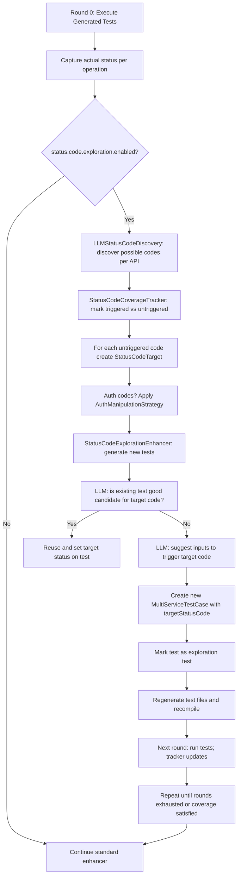

### StatusCodeTarget and Discovery

- **StatusCodeTarget**: Combines `statusCode` (e.g. 401, 404), `strategy` (e.g. `INVALID_AUTH`, `NOT_FOUND`), and optional `suggestedInputs` from the LLM.
- **LLMStatusCodeDiscovery**: Runs once after the first execution. For each operation, calls the LLM with OpenAPI operation info and domain (e.g. “train ticket”) to list possible status codes and brief reasons. Results are stored and used to build targets for untriggered codes.

### StatusCodeCoverageTracker

- **Role**: Tracks, per operation (e.g. by method + path), which status codes have been triggered in any run and which are still missing.
- **Input**: Actual status codes from test execution (via writer/collector).
- **Output**: Sets of “triggered” vs “untriggered” codes per operation, driving which StatusCodeTargets the enhancer creates.

### AuthManipulationStrategy

Used when the target code is auth-related (e.g. 401, 403):

- **token_invalidation**: Generate or reuse a scenario where the token is expired/invalid so the API returns 401/403.
- **multi_user**: Use a different user (e.g. different credentials or role) so the API returns 403 Forbidden.
- Configurable via `status.code.exploration.auth.strategy` (`token_invalidation`, `multi_user`, or `both`).

### StatusCodeExplorationEnhancer Workflow

1. **After first run**: Tracker knows triggered vs untriggered codes; discovery has suggested possible codes per API.
2. **For each untriggered code**: Build a StatusCodeTarget (with strategy and optional suggested inputs). For auth codes, apply AuthManipulationStrategy.
3. **Candidate check**: For existing tests (e.g. from enhancer), optionally ask LLM whether the test is a good candidate to trigger a given target code. If yes, set that test’s target status and mark as exploration test.
4. **New tests**: If no suitable existing test, ask LLM for inputs that would trigger the target code; create new MultiServiceTestCase with `targetStatusCode` and mark as exploration test.
5. **Cap**: Respect `status.code.exploration.max.new.tests.per.operation` and `status.code.exploration.skip.5xx` when creating exploration tests.
6. **Regeneration**: New/updated exploration tests are written by the same writer, recompiled, and run in the next round; tracker is updated from new results.

### MultiServiceTestCase and Writer

- **MultiServiceTestCase**: Can carry `targetStatusCode` and an “exploration test” flag so the writer and reporting know the test is meant to trigger a specific code.
- **MultiServiceRESTAssuredWriter**: For exploration tests, validates response against `targetStatusCode` (test passes if actual status equals target). Exploration tests are reported in Allure (e.g. label or parameter indicating “Status Code Exploration” and the target code).

### Configuration Summary

| Property | Purpose |
|----------|---------|
| status.code.exploration.enabled | Master switch for status code discovery and exploration tests |
| status.code.exploration.max.per.test | Max exploration tests to create per original test per round (default: 3) |
| status.code.exploration.max.per.round | Max exploration tests total per round (prevents test explosion, default: 20) |
| status.code.auth.invalid.token | Invalid token to use for 401 Unauthorized exploration |
| status.code.auth.expired.token | Expired JWT token for auth testing |
| status.code.auth.guest.user/password | Guest credentials for 403 Forbidden testing |
| status.code.auth.restricted.user/password | Restricted user credentials for 403 testing |

### Classes Involved

| Class | Responsibility |
|-------|----------------|
| LLMStatusCodeDiscovery | Discovers possible status codes per API via LLM (and OpenAPI) after first run |
| StatusCodeCoverageTracker | Tracks triggered vs untriggered status codes per operation |
| StatusCodeTarget | Holds target code, strategy, and optional suggested inputs |
| AuthManipulationStrategy | Produces token invalidation and multi-user scenarios for auth codes |
| StatusCodeExplorationEnhancer | Creates/reuses tests for untriggered codes; uses LLM for candidate check and input suggestions |
| ZeroShotLLMGenerator | Extended with status code discovery and exploration candidate evaluation prompts |
| MultiServiceTestCase | Carries targetStatusCode and exploration-test flag |
| MultiServiceRESTAssuredWriter | Validates exploration tests against target code; reports in Allure |

