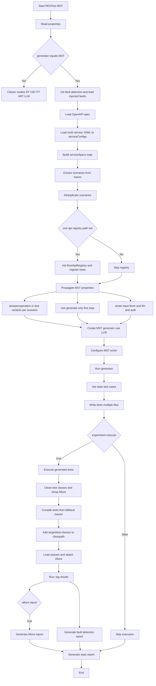
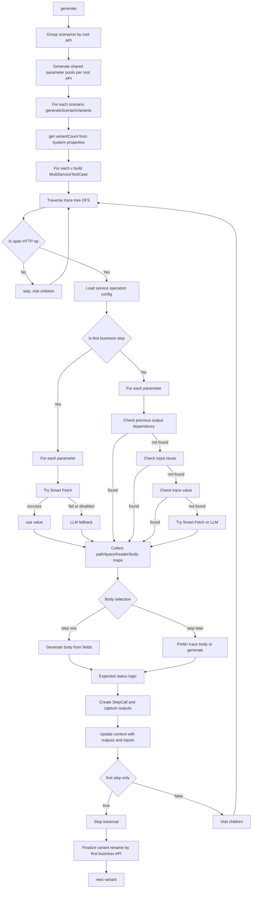
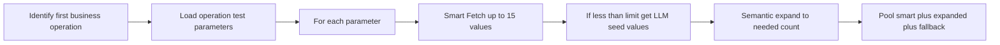
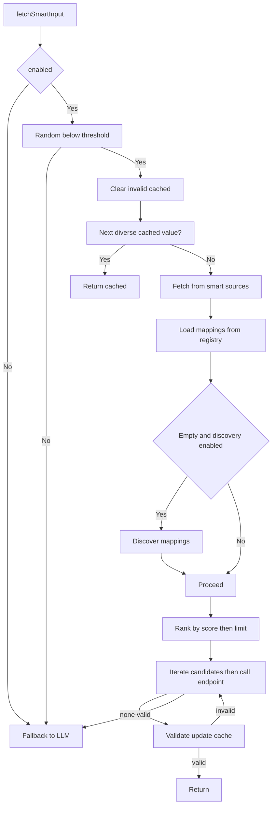
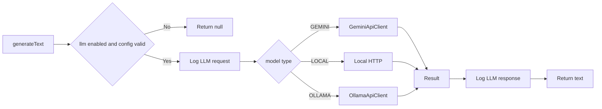
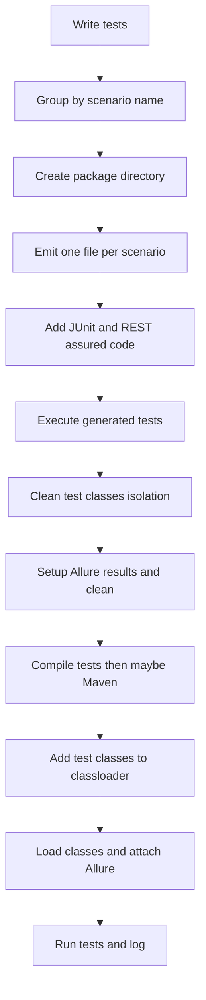

### MST Mode End-to-End Flow (TestGenerationAndExecution.java)

### MST Test Case and Input Generation (MultiServiceTestCaseGenerator)

### Shared Parameter Pool Generation (per root API)

### Smart Input Fetching Flow (SmartInputFetcher)

### LLM Communication Path (LLMService)

### Writer and Execution Flow (MultiServiceRESTAssuredWriter + IntelliJ runner)

### Conditions, Flags, and Inputs (key branches)

- generator == MST: switches to multi-service flow
- testsperoperation / test.variants.per.scenario: number of variants per scenario
- mst.generate.only.first.step: generate only first business step (writer handles login as step 0)
- smart.input.fetch.enabled: enables Smart Fetch system
- smart.input.fetch.percentage: probability Smart Fetch vs LLM
- smart.input.fetch.registry.path: registry used for mappings and learning
- smart.input.fetch.llm.discovery.enabled: allows LLM-based mapping discovery
- smart.input.fetch.max.candidates: max endpoints tried per parameter
- smart.input.fetch.dependency.resolution.enabled: resolve parameter dependencies
- smart.input.fetch.discovery.timeout.ms: discovery request timeout
- smart.input.fetch.cache.enabled / ttl: cache values and TTL
- llm.enabled: enables LLM; llm.model.type: gemini/local/ollama
- llm.gemini.*, llm.local.*, llm.ollama.*: backend-specific
- llm.rate.limit.retry.enabled / max.retries: retry policy
- root.api.registry.path: enables Root API registry population from scenarios
- allure.report: generate Allure report after execution
- experiment.execute: execute tests vs only generate
- deletepreviousresults: clean allure/data outputs before run
- fault.detection.injected.faults.path / fault.detection.report.dir: fault injection & reporting

### Notes on Data/Status Selection

- First business step: parameters prefer Smart Fetch -> LLM fallback; body from generated fields
- Subsequent steps: prefer dependencies (prev outputs -> inputs) -> trace -> Smart Fetch -> LLM -> fallback
- Expected status: config -> successful status from trace (if config 200) -> default 200

